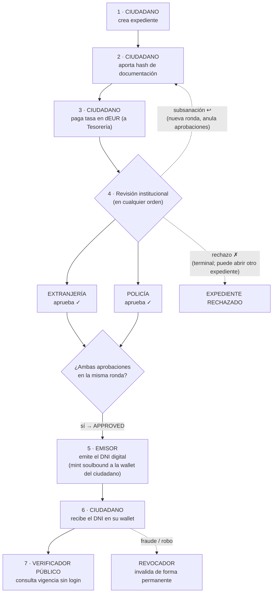

# Propuesta de TFM — Expediente de Nacionalidad y DNI Digital sobre Blockchain Permisionada

**Máster en Ingeniería y Desarrollo Blockchain (MDB) — Fase 1: Propuesta de proyecto**
**Alumno:** Maximiliano Morero · **Tipo de proyecto:** caso de uso original
**Título de trabajo:** *ebis-nacionalidad-ledger*

---

## 1. Objetivo del proyecto

Construir una solución completa (red blockchain + smart contracts + API + aplicación web) que digitalice el trámite de **solicitud de nacionalidad** de un ciudadano extranjero y culmine en la emisión de un **DNI digital verificable**: una credencial no transferible (*soulbound token* ERC-721) anclada a la wallet del ciudadano, que cualquier tercero puede verificar públicamente sin depender de la administración emisora.

El sistema cubrirá el ciclo de vida completo: apertura del expediente, aporte de documentación, pago de la tasa con un euro digital de demostración (ERC-20), doble aprobación institucional independiente (Extranjería y Policía), emisión de la credencial, verificación pública y revocación.

## 2. Necesidad / oportunidad a cubrir

Hoy un trámite de nacionalidad involucra a varias entidades públicas que no comparten sistemas: el ciudadano no tiene visibilidad del estado real, cada organismo mantiene su propio registro, y el documento final (DNI/certificado) es verificable solo contra la base de datos del emisor. Esto genera tres problemas concretos que la blockchain permisionada resuelve bien:

1. **Confianza entre entidades sin un intermediario central**: Extranjería y Policía aprueban de forma independiente y ninguna puede alterar la decisión de la otra; las reglas se ejecutan en el smart contract, no en el sistema de un organismo.
2. **Trazabilidad inmutable**: cada transición del expediente (creación, pago, aprobación, rechazo, emisión, revocación) queda registrada como transacción auditable.
3. **Verificación descentralizada de la credencial**: un hotel, un banco o una comisaría pueden comprobar la vigencia del DNI digital consultando la cadena, sin acceder a datos personales — en la cadena solo se guarda un hash (*data commitment*), nunca PII, alineado con RGPD.

## 3. Actores del sistema

| Actor | Wallet/Rol on-chain | Qué hace |
|---|---|---|
| **Ciudadano** | dueño del expediente | Crea su expediente, aporta el hash de su documentación, paga la tasa en dEUR y recibe el DNI digital en su wallet. |
| **Extranjería** | `FOREIGN_AFFAIRS_ROLE` | Revisa el expediente y lo aprueba, pide subsanación o lo rechaza. |
| **Policía** | `POLICE_ROLE` | Segunda aprobación independiente (antecedentes); mismas acciones que Extranjería. Un mismo actor no puede tener ambos roles institucionales. |
| **Emisor de credencial** | `CREDENTIAL_ISSUER_ROLE` | Con el expediente doblemente aprobado, emite el DNI digital hacia la wallet del ciudadano. |
| **Revocador** | `REVOKER_ROLE` | Invalida una credencial de forma permanente (fraude, robo), con código de motivo. Rol separado del emisor. |
| **Verificador público** | sin rol (acceso libre) | Cualquier tercero: consulta la vigencia de un DNI digital sin autenticarse. |
| **Tesorería / Operador dEUR** | `FEE_COLLECTOR_ROLE` | Recibe las tasas; administra el faucet del euro digital de demo. |

## 4. Flujo de aprobación del expediente

**Reglas de negocio principales:**

- Un ciudadano solo puede tener **un expediente activo** a la vez; tras un rechazo puede abrir otro, tras una aprobación no.
- El pago de la tasa es **atómico** (allowance ERC-20 + transferencia a tesorería) y no puede duplicarse.
- Se exigen **las dos aprobaciones institucionales** (Extranjería y Policía) sobre la misma ronda de revisión; una subsanación invalida las aprobaciones previas y abre una ronda nueva.
- El DNI digital: su `tokenId` es el número de expediente, **no se puede transferir ni aprobar** (toda transferencia revierte), tiene fecha de caducidad, y solo guarda on-chain un hash de los datos — nunca datos personales.
- La **revocación es irreversible** y queda registrada con motivo; toda verificación posterior reflejará el estado revocado. La verificación comprueba tanto revocación como caducidad, leyendo directamente de la cadena.
- Solo el contrato de expedientes puede mintear credenciales: el emisor humano no puede emitir un DNI fuera del flujo aprobado ni hacia una wallet arbitraria.

## 5. Pantallas de la aplicación

| # | Pantalla | Usuario | Contenido |
|---|---|---|---|
| 1 | **Conexión de wallet** | todos | Conexión MetaMask; detección del rol on-chain de la cuenta y redirección a su portal. |
| 2 | **Portal Ciudadano** | ciudadano | Estado de su expediente, saldo dEUR, faucet, acciones según fase (subir hash de docs, pagar tasa). |
| 3 | **Detalle de expediente (ciudadano)** | ciudadano | Línea de tiempo del trámite con eventos on-chain y su DNI digital (anverso/reverso) al final. |
| 4 | **Portal Extranjería** + detalle | extranjería | Bandeja de expedientes en revisión; aprobar / pedir subsanación / rechazar firmando con su wallet. |
| 5 | **Portal Policía** + detalle | policía | Igual que Extranjería, con su aprobación independiente y consulta de la identidad verificada. |
| 6 | **Portal Emisor** + detalle | emisor | Expedientes aprobados pendientes de emisión; botón "Emitir credencial" (mint del DNI). |
| 7 | **Portal Verificador (público)** | cualquiera | Sin login: se introduce el nº de credencial y se muestra el DNI digital con su estado (vigente / caducado / revocado). |
| 8 | **Administración dEUR** | operador | Mint de saldo demo, habilitar faucet, vista de tesorería. |

## 6. Tecnologías

| Capa | Tecnología |
|---|---|
| **Red blockchain** | Hyperledger Besu, red privada permisionada con consenso **QBFT** (4 validadores + nodo RPC), orquestada con Docker Compose. |
| **Smart contracts** | Solidity 0.8.x + OpenZeppelin (AccessControl, ERC-20, ERC-721 soulbound). Tres contratos: `NationalityCaseRegistry` (máquina de estados del expediente), `NationalityCredential` (DNI digital ERC-721 no transferible), `DigitalEuroDemo` (ERC-20 para tasas). Tooling: Hardhat + viem, suite de tests unitarios y de integración. |
| **API backend** | Java + Spring Boot, arquitectura hexagonal, Web3j como cliente de la cadena, PostgreSQL (proyección de eventos on-chain para consultas), autenticación SIWE/JWT, OpenAPI. |
| **Frontend** | React + TypeScript (Vite), wagmi/viem + RainbowKit para integración de wallet (las transacciones las firma el usuario en MetaMask), TanStack Query contra la API. |
| **Explorador** | Blockscout local para inspeccionar bloques, transacciones y contratos. |
| **Monitorización** | **Prometheus + Grafana** (dashboard con altura de bloque y peers por validador Besu, latencia y volumen HTTP de la API), completado con OpenTelemetry Collector, Loki (logs) y Tempo (trazas). |

## 7. Entregables y alineación con la evaluación

Al cierre de la Fase 2 se entregará: **(1)** el documento de definición con arquitectura y librerías, **(2)** el código fuente en un repositorio GitHub documentado, compartido con el usuario `DomingoMr`, y **(3)** la aplicación web ejecutable con un único comando (`make demo-complete`) que levanta red, contratos, API, frontend y monitorización con datos de demo, sobre la que se hará la defensa de 15 minutos.

El alcance cubre los cuatro criterios de evaluación: desarrollo de contratos y API (contratos con roles, máquina de estados y tests + API Spring Boot), frontal integrado con la API y con la wallet, monitorización Prometheus + Grafana, e innovación (identidad soulbound con privacidad por *data commitment*, doble aprobación institucional descentralizada y verificación pública sin custodia de datos personales).
